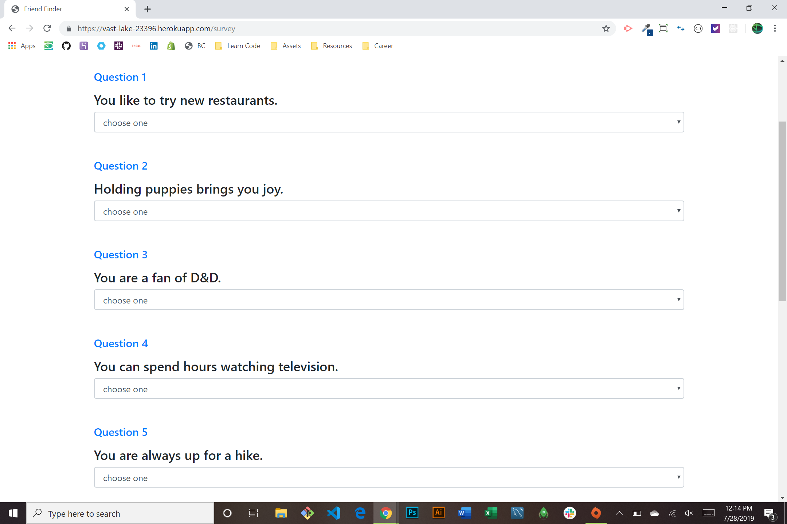

# Friend  Finder

### About this Project

User adds a name and image URL, then completes a series of 10 questions and the survey data is stored on a live heroku server. When the survey is submitted, it is compared to an array of other finished surveys and the one with the most similar answers will be recomended as a friend.
  
  **Visit Web App [Here!](https://vast-lake-23396.herokuapp.com/)**

### Technologies used

* HTML
* CSS
* JavaScript
* jQuery
* Bootstrap
